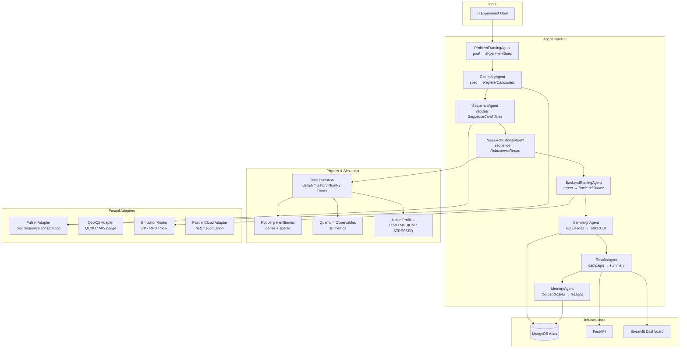
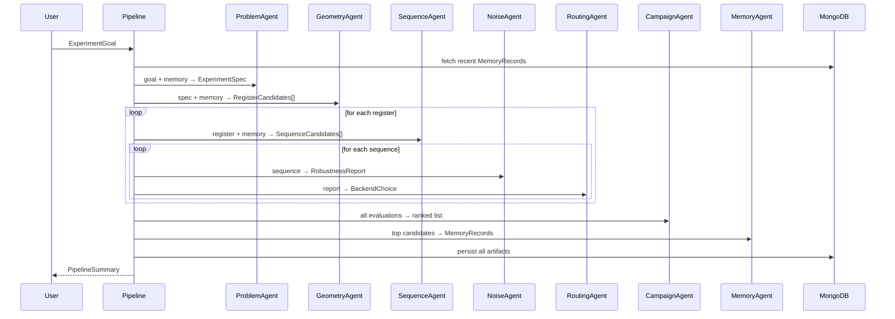
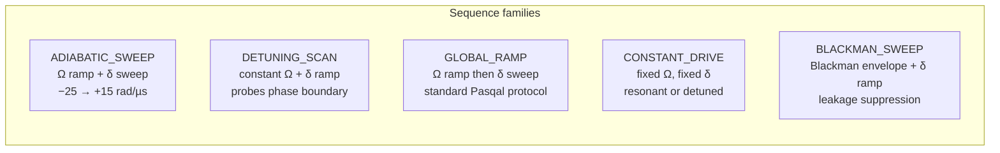
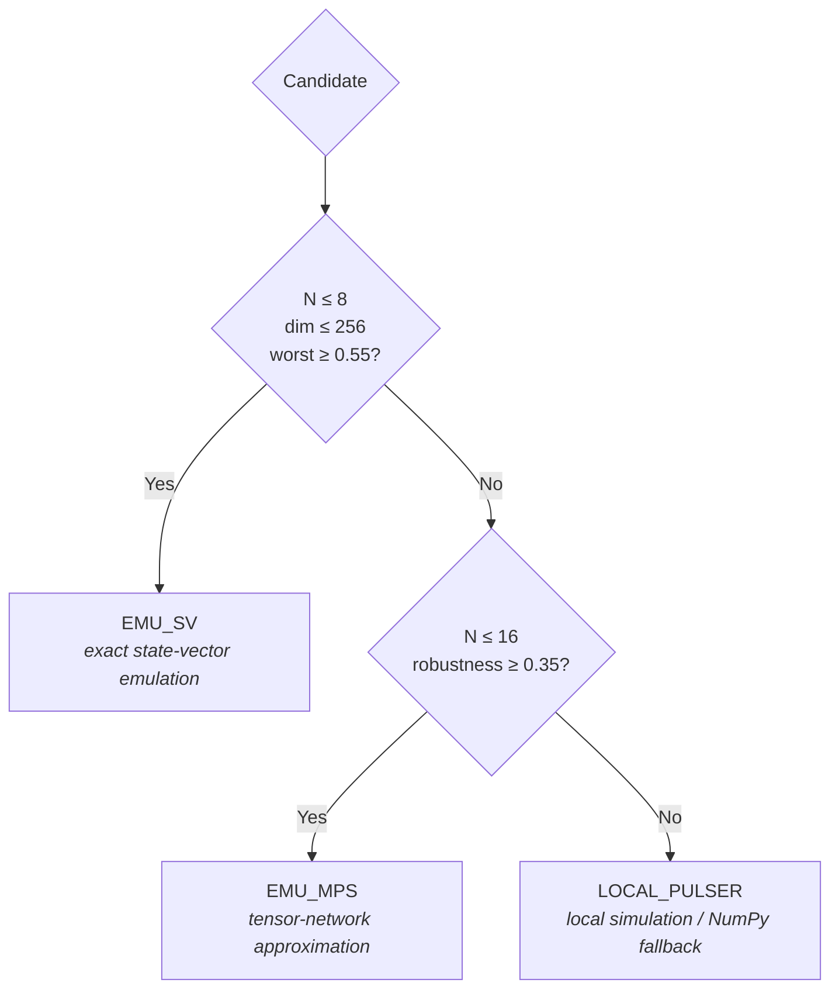
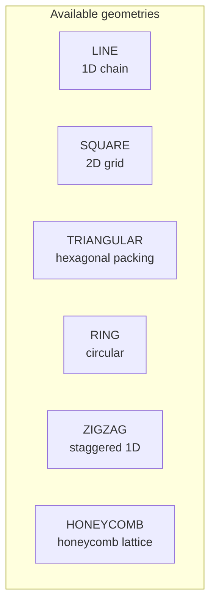

# CryoSwarm-Q

**Hardware-aware multi-agent orchestration for autonomous neutral-atom experiment design.**

CryoSwarm-Q is a research software prototype that sits between human scientific intent and pulse-level neutral-atom programming. Given a structured experiment goal, it generates register candidates, builds Pulser-compatible pulse sequences, evaluates robustness under realistic noise, routes candidates to appropriate backends, ranks them, and persists lessons for cross-campaign reuse.

The physics stack is real: the code constructs Rydberg Hamiltonians with verified interaction coefficients, computes quantum observables from state vectors, runs time evolution via exact diagonalisation, and validates everything against Pasqal's `AnalogDevice` constraints.

---

## Architecture



### Pipeline stages



---

## Repository layout

```
packages/
├── core/              # Pydantic models, enums, config, logging
├── agents/            # 8 specialised agents
├── orchestration/     # Pipeline + demo runner
├── simulation/        # Hamiltonian, observables, evaluators, numpy backend, noise
├── scoring/           # Objective function, robustness, ranking
├── pasqal_adapters/   # Pulser, QoolQit, emulator router, Pasqal Cloud
└── db/                # MongoDB repositories
apps/
├── api/               # FastAPI (health, goals, campaigns, candidates)
└── dashboard/         # Streamlit UI
tests/                 # 14+ test files, 100+ tests
scripts/               # Demo runner, seed, mongo check
```

---

## Physics core

### Rydberg Hamiltonian

CryoSwarm-Q models the driven Rydberg system with the standard Hamiltonian:

$$H = \frac{\Omega}{2}\sum_{i} \sigma_x^{(i)} \;-\; \delta\sum_{i} n_i \;+\; \sum_{i<j} \frac{C_6}{r_{ij}^{\,6}}\, n_i\, n_j$$

| Symbol | Meaning | Typical range |
|--------|---------|---------------|
| $\Omega$ | Global Rabi frequency | 4 – 8.5 rad/µs |
| $\delta$ | Laser detuning | −30 to +15 rad/µs |
| $n_i = \|r\rangle\langle r\|_i$ | Rydberg occupation | 0 or 1 |
| $C_6$ | Van der Waals coefficient | 862 690 rad·µm⁶/µs |
| $r_{ij}$ | Inter-atomic distance | 5 – 15 µm |

The $C_6$ value corresponds to $^{87}$Rb in the $\|70S_{1/2}\rangle$ Rydberg state (literature-verified).

### Blockade radius

Two atoms cannot both be excited if their separation is smaller than the blockade radius:

$$R_b = \left(\frac{C_6}{\Omega}\right)^{1/6}$$

At $\Omega = 5$ rad/µs → $R_b \approx 7.5$ µm. The system operates in the interesting regime where $R_b \approx$ lattice spacing, enabling quantum phase transitions between disordered and ordered Rydberg phases.

### Interaction graph and MIS

The blockade constraint defines a graph $G = (V, E)$ where atoms are vertices and edges connect pairs with $r_{ij} < R_b$. The ground state of the Rydberg Hamiltonian (at large positive $\delta$) approximates the **Maximum Independent Set** (MIS) of this graph — the core computational problem targeted by neutral-atom quantum processors.

CryoSwarm-Q enumerates MIS solutions via brute-force search (≤20 atoms) and computes the overlap between the final quantum state and the MIS subspace.

---

## Quantum observables

The simulation layer extracts 10 observables from the final quantum state $|\psi\rangle$:

| Observable | Formula | Purpose |
|-----------|---------|---------|
| **Rydberg density** | $\langle n_i \rangle = \langle\psi| n_i |\psi\rangle$ | Per-site excitation probability |
| **Total Rydberg fraction** | $\bar{n} = \frac{1}{N}\sum_i \langle n_i \rangle$ | Global excitation density |
| **Pair correlation** | $g_{ij} = \langle n_i n_j \rangle$ | Joint excitation probability |
| **Connected correlation** | $g_{ij}^c = \langle n_i n_j \rangle - \langle n_i\rangle\langle n_j\rangle$ | Quantum correlations beyond mean-field |
| **AF order parameter** | $m_{AF} = \frac{1}{N}\left|\sum_i (-1)^i (2\langle n_i\rangle - 1)\right|$ | Antiferromagnetic ordering |
| **Entanglement entropy** | $S_A = -\mathrm{Tr}(\rho_A \log \rho_A)$ via SVD | Bipartite entanglement |
| **State fidelity** | $F = |\langle\psi_1|\psi_2\rangle|^2$ | Overlap with target state |
| **Bitstring probabilities** | $p_k = |\langle k|\psi\rangle|^2$ | Computational basis weights |
| **MIS overlap** | $\sum_{k \in \mathrm{MIS}} p_k$ | Weight on MIS solutions |
| **Spectral gap** | $\Delta = E_1 - E_0$ | Adiabatic robustness indicator |

Convention: $|g\rangle = |0\rangle$, $|r\rangle = |1\rangle$, qubit 0 is the most significant bit.

---

## Pulse sequence families

The `SequenceAgent` generates candidates across five families, each exploring different regions of the phase diagram:



All amplitudes stay within `AnalogDevice` limits (~15.7 rad/µs max). Durations scale with atom count (2000–5000 ns). The adapter clips to 85% of device max as a safety margin and quantises durations to the 4 ns clock period.

---

## Robustness evaluation

Each candidate is evaluated under four conditions:

| Scenario | Temp (µK) | Amp. jitter | Dephasing | Atom loss | SPAM prep | SPAM FP | SPAM FN |
|----------|:---------:|:-----------:|:---------:|:---------:|:---------:|:-------:|:-------:|
| **Nominal** | — | — | — | — | — | — | — |
| **Low noise** | 30 | 3% | 0.03 | 1% | 0.3% | 0.8% | 2% |
| **Medium noise** | 50 | 6% | 0.07 | 3% | 0.5% | 1% | 5% |
| **Stressed noise** | 75 | 10% | 0.11 | 5% | 1% | 2% | 8% |

The **robustness score** aggregates these evaluations:

$$R = 0.25\,S_{\mathrm{nom}} + 0.35\,\bar{S}_{\mathrm{pert}} + 0.30\,S_{\mathrm{worst}} + 0.10\,B_{\mathrm{stab}}$$

where $B_{\mathrm{stab}} = \max(0,\; 1 - \sigma/0.2)$ is a stability bonus that rewards low variance across noise scenarios.

The **observable score** combines density fidelity and blockade compliance:

$$O = 0.70 \cdot D_{\mathrm{score}} + 0.30 \cdot B_{\mathrm{score}}$$

The final **campaign objective** ranks candidates by:

$$J = \alpha\, O + \beta\, R - \gamma\, C - \delta\, L$$

| Weight | Default | Meaning |
|--------|:-------:|---------|
| $\alpha$ | 0.45 | Observable quality |
| $\beta$ | 0.35 | Robustness |
| $\gamma$ | 0.10 | Estimated compute cost |
| $\delta$ | 0.10 | Estimated latency |

---

## Backend routing

The `BackendRoutingAgent` selects the simulation or execution backend based on system size and candidate quality:



---

## Register geometries

The `GeometryAgent` generates atom arrangements across six layout types:



Each register is validated against `AnalogDevice` constraints (min distance 4 µm, max atoms). The agent computes the van der Waals interaction matrix and blockade pair count, then assigns a feasibility score:

$$f = 0.55 + 0.20 \cdot \min\!\left(\frac{d_{\min}}{5},\; 1.5\right) + 0.20 \cdot \frac{N_{\mathrm{blockade}}}{N-1} - 0.04 \cdot \max(N - 6, 0)$$

Spacing values default to 7.0 and 8.5 µm, chosen so that $R_b \approx$ spacing at typical Rabi frequencies.

---

## Memory system

The `MemoryAgent` captures reusable lessons from completed campaigns:

- **Success patterns** from the top 3 candidates: layout, family, spacing, amplitude, detuning, robustness band, backend choice
- **Failure patterns** from the worst candidate: noise sensitivity, weak observables
- **Confidence signal**: $c = R_{\mathrm{score}} \times (1 - \sigma)$

On subsequent campaigns, agents exploit memory:
- `GeometryAgent` prioritises layouts and spacings from high-confidence past results
- `SequenceAgent` generates refined variants at ±10% of remembered strong parameters
- Both agents avoid configurations tagged as failures

---

## Installation

```bash
pip install -e ".[dev]"
```

Or with the requirements file:

```bash
pip install -r requirements.txt
```

### Dependencies

| Package | Version | Role |
|---------|---------|------|
| `pulser` | ≥1.6, <1.7 | Register validation, sequence construction, emulation |
| `pulser-simulation` | — | QutipEmulator backend |
| `scipy` | ≥1.13 | Sparse Hamiltonian, exact diagonalisation, time evolution |
| `numpy` | ≥2.1 | Core numerics, observables |
| `fastapi` | ≥0.115 | REST API |
| `pydantic` | ≥2.8 | Typed domain models |
| `pymongo` | ≥4.7 | MongoDB persistence |
| `streamlit` | ≥1.38 | Dashboard |
| `pasqal-cloud` | ≥0.22 | Pasqal Cloud batch submission |
| `qoolqit` | ≥0.4 | QUBO / MIS bridge |

---

## Environment

Copy `.env.example` to `.env` and configure:

```env
# Required
MONGODB_URI=mongodb+srv://...
MONGODB_DB=cryoswarm_q
APP_ENV=development
LOG_LEVEL=INFO

# Optional — Pasqal Cloud (safe without these)
PASQAL_CLOUD_PROJECT_ID=
PASQAL_TOKEN=
```

---

## Quick start

```bash
# Check MongoDB connectivity
python scripts/test_mongo.py

# Run a demo campaign
python scripts/run_demo_pipeline.py

# Seed a stored goal
python scripts/seed_demo_goal.py
```

Example output:

```
campaign_id: campaign_a3f7c
status: COMPLETED
total_candidates: 40
ranked_count: 40
top_candidate_id: seq_e91b2
backend_mix:
  emu_sv_candidate: 16
  local_pulser_simulation: 24
decisions: 8 agent decisions recorded
memory_records: 4 lessons stored
```

---

## API

```bash
uvicorn apps.api.main:app --reload
```

| Method | Endpoint | Description |
|--------|----------|-------------|
| `GET` | `/health` | Environment and MongoDB readiness |
| `POST` | `/goals` | Create an experiment goal |
| `GET` | `/goals/{goal_id}` | Retrieve a goal |
| `POST` | `/campaigns/run-demo` | Run a full orchestration campaign |
| `GET` | `/campaigns/{campaign_id}` | Retrieve campaign state |
| `GET` | `/campaigns/{id}/candidates` | List ranked candidates |

All endpoints return structured JSON with Pydantic-validated models. Error responses include status codes (404, 422, 500) with detail messages.

---

## Dashboard

```bash
streamlit run apps/dashboard/app.py
```

Features:
- Goal creation form with atom count, geometry, and priority controls
- Campaign execution and live status
- Ranked candidate table with scores
- Agent decision trace per campaign
- Register scatter plots with blockade-radius overlays
- Robustness comparison charts across candidates
- Noise sensitivity plots for the top candidate

---

## Testing

```bash
pytest tests/ -v
```

The test suite covers:

| Area | Tests | What is verified |
|------|:-----:|-----------------|
| Hamiltonian physics | 15 | Distances, vdW, $R_b$, MIS, hermiticity, spectrum, blockade suppression |
| Quantum observables | 17 | Density, correlations, AF order, entanglement, fidelity, bitstrings |
| NumPy simulation | 10 | Rabi oscillations, blockade, adiabatic sweep, Blackman, AF ordering |
| Geometry agent | 10 | 6 layouts, spacing, feasibility, constraints |
| Sequence agent | 9 | 5 families, amplitude/detuning/duration ranges, memory exploitation |
| Scoring | 15 | Clamp, perturbation stats, robustness formula, bounded output |
| Noise profiles | 6 | Ordering, temperature, SPAM ranges, jitter bounds |
| Routing | 4 | EMU_SV / EMU_MPS / LOCAL decision boundaries |
| Objective function | 5 | Weighted formula, ordering, default weights |
| Pipeline integration | ✓ | End-to-end with mock repository |
| Error handling | ✓ | Validation errors, atom limits, graceful failures |
| Adapters | ✓ | Pasqal Cloud (mocked), QoolQit QUBO construction |

---

## Pasqal ecosystem alignment

This repository is aligned with public Pasqal-oriented tools. It does not claim proprietary access or formal collaboration.

| Adapter | Status | Integration |
|---------|--------|-------------|
| **Pulser** | Real | Register validation, sequence construction (`RampWaveform`, `BlackmanWaveform`, `ConstantPulse`), `QutipEmulator` evaluation |
| **QoolQit** | Functional | QUBO construction from blockade graphs for MIS problems |
| **Pasqal Cloud** | Credential-gated | Live SDK adapter, activates only with `PASQAL_TOKEN` |
| **Emulator Router** | Rule-based | Routes to SV, MPS, or local based on system size and robustness |

---

## Current limitations

- Research-grade prototype, not a lab-calibrated experimental stack
- Dense Hamiltonian limited to ~14 atoms; sparse path extends to ~20
- Backend routing is rule-based, not learned
- Pasqal Cloud submission is credential-gated and not exercised in CI
- Memory exploitation uses tag matching, not semantic similarity
- Sequence search space is structured (5 families × 2-3 variants), not continuous

## Roadmap

- Benchmark against canonical neutral-atom cases (AF ordering, MIS instances)
- Sparse + MPS simulation paths for 20+ atoms
- Bayesian or bandit-style sequence optimisation
- Hardware-constraint modelling beyond AnalogDevice
- Richer campaign analytics and comparative dashboards
- Pasqal Cloud batch submission hardening

---

## License

Research prototype. See repository for terms.
